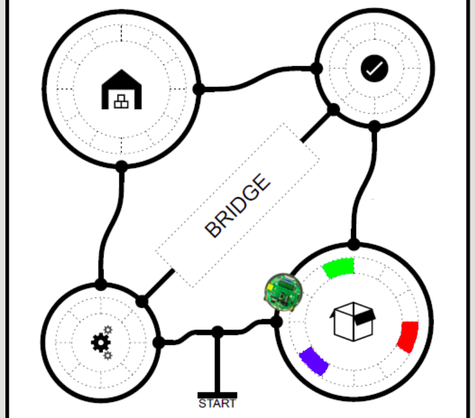
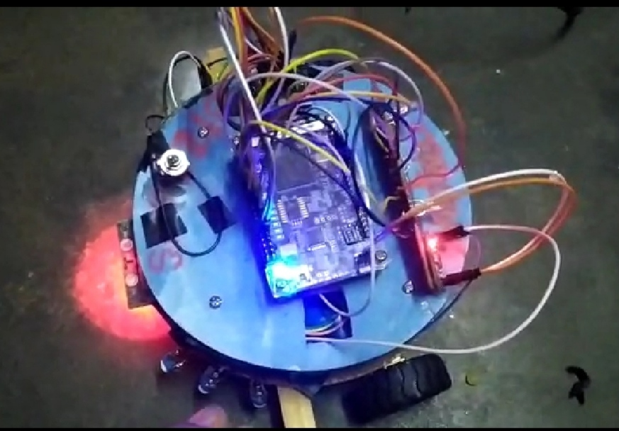

# E-Yantra-Sankatmochan-Bot-
This repo Contains all the works for building Sankatmochan bot for the theme conducted under eyantra'21, It consists of building and programming a bot which will able to leverage the parallel processing of FPGA.

 <b>FPGA used by us is of Altera</b>  
  

  

- Task 0 : 19 October 2020
- Task 1 : 02 November 2020
- Task 2 : 23 November 2020
- Task 3 : 23 December 2020
- Task 4 : 21 January 2021(Till this part we completed and this part was related to hardware implemntation)

Final Arena looks like this

  

**Our Bot**

  
 <b>Hardware includes a Color sensor, Line following sensor, 
 XBEE Module for communication, Altera FPGA,<b> Voltage Regulators,
 LEDs, UART Module, Lithium Battery and a three way switch</b>

